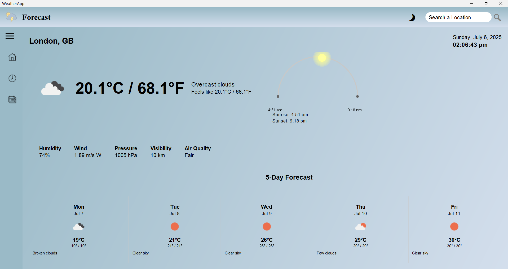
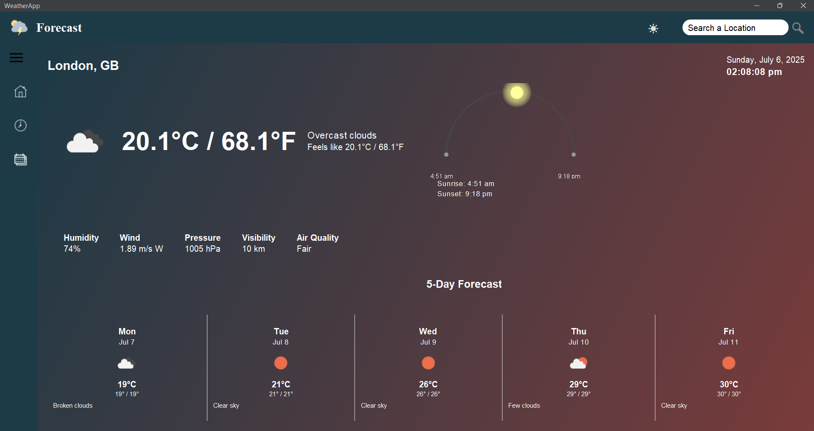
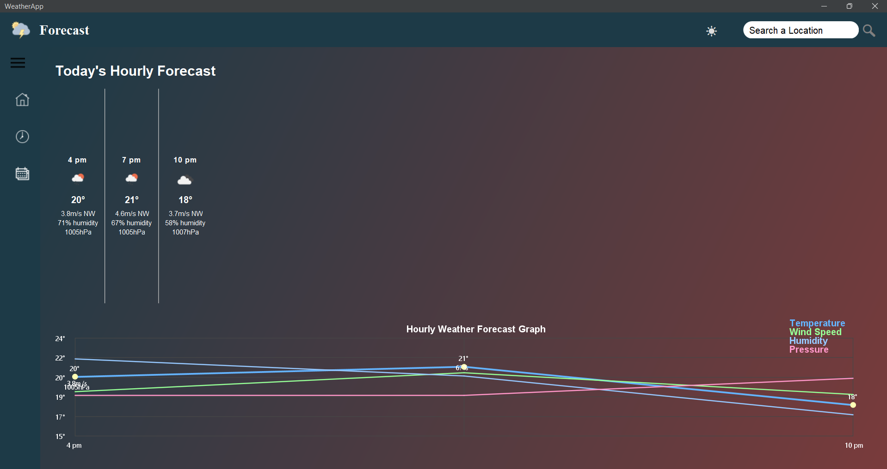

# Weather App Using Java & API (JSON Parsing)

A comprehensive weather application built with Java Swing that provides current weather conditions, hourly forecasts, and monthly predictions for locations worldwide.

## Features

- **Current Weather**: Displays temperature, humidity, wind speed, pressure, visibility, and air quality index
- **Hourly Forecast**: Detailed hourly weather predictions with temperature graph
- **Monthly Forecast**: 6-month weather outlook with trends
- **Location Search**: Search for any city worldwide with auto-suggestions
- **Dark/Light Mode**: Toggle between dark and light themes
- **Responsive UI**: Adapts to different screen sizes
- **Sunrise/Sunset Animation**: Visual representation of daylight hours
- **Weather Icons**: Visual representation of current conditions

## Technologies Used

- Java Swing for the user interface
- OpenWeatherMap API for weather data
- FlatLaf for modern UI styling
- JSON for data handling

## Requirements

- Java 8 or higher
- Internet connection (for API calls)
- Maven (for dependency management)

## Dependencies

- org.json for JSON processing
- com.formdev.flatlaf for modern UI components

## Installation

1. Clone the repository:
   ```bash
   git clone https://github.com/yourusername/WeatherApp.git
   ```
2. Navigate to the project directory:
   ```bash
   cd WeatherApp
   ```
3. Compile and run:
   ```bash
   javac WeatherApp.java
   java WeatherApp
   ```
4. Add Jar files in library folder :
   ```bash
   flatlaf-3.6
   json-20250517
   ```

## Configuration

You need to obtain an API key from [OpenWeatherMap](https://openweathermap.org/) and replace the `API_KEY` constant in the code.

## Usage

1. Enter a location in the search field
2. View current weather conditions on the home screen
3. Switch between hourly and monthly forecasts using the sidebar menu
4. Toggle dark/light mode using the moon/sun icon

## Screenshots






## License

This project is licensed under the MIT License - see the [LICENSE](LICENSE) file for details.

## Acknowledgments

- OpenWeatherMap for providing the weather data API
- FlatLaf for the modern Java Swing look and feel
- Icons from [icons8](https://icons8.com/)
